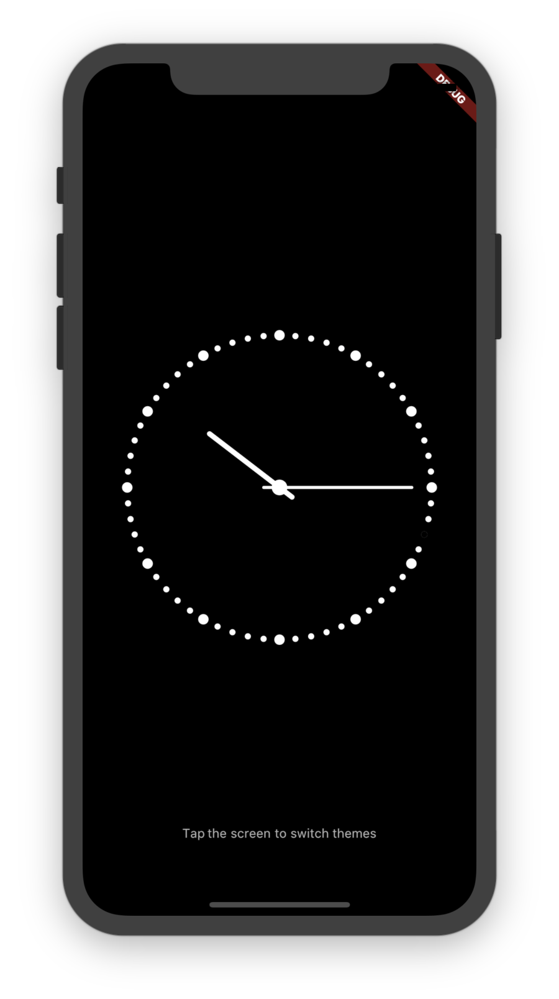
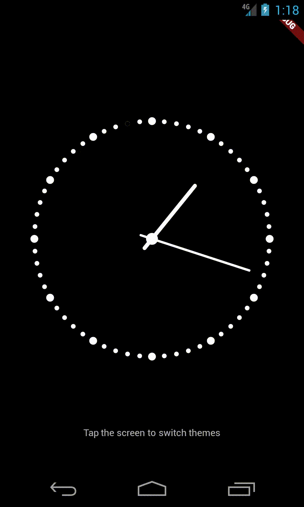

# dsc_flutter_clock

A sample clock app to demonstrate some of Flutter's patterns.

## Screenshots

On an iPhone X emulator (iOS 11.4)           | On a Nexus 4 emulator (Android 4.2)
:-------------------------------------------:|:------------------------------------------:
  |  

## Getting Started

You will need to have Flutter installed and set up [see here](https://flutter.io/get-started/install/).

Then `flutter run` in the root of the project directory to launch the app
in debug mode on a connected device or emulator.

`flutter build` and `flutter install` will install the app in release mode.

## TODO

- [ ] Add docstrings
- [ ] Demonstrate testing
